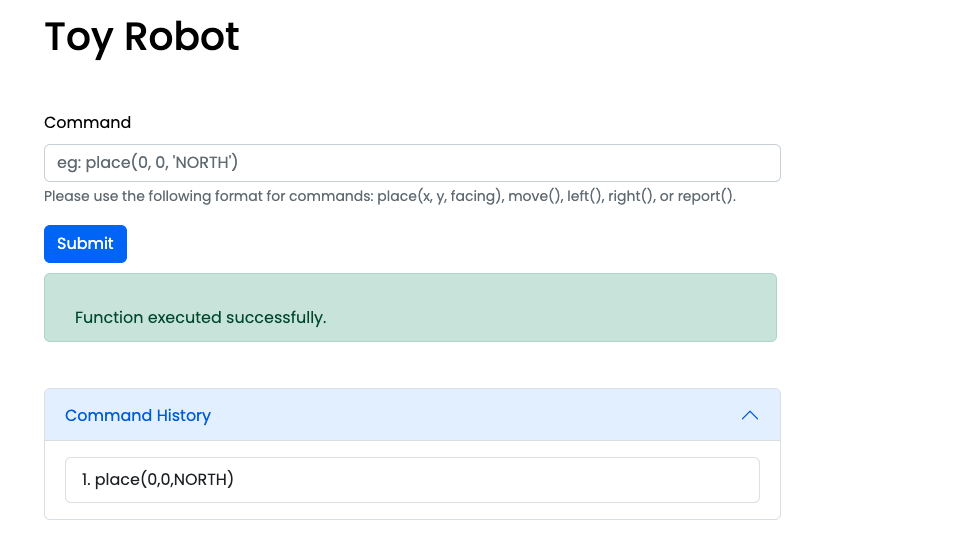

# Toy-Robot React Application

### Yumi Yu

------

🖥 GitHub Repo: https://github.com/Yumi2121/ToyRobert


## **Project Description**

Welcome to the Toy Robot Control App! 

This application is a simulation of a toy robot moving on a square tabletop with dimensions of 5 units x 5 units. The surface of the table has no other obstructions, allowing the robot to freely roam around the table.

Remember that the robot must be placed on the grid with a valid command before any other commands can be executed. Have fun exploring the table with your toy robot and keep it safe from falling off!


## Instructions

Use below commands to control the toy robot:

```
place(X,Y,facing)
move()
left()
right()
report()
```

- `place` will put the toy robot on the table in position `X,Y` and facing `NORTH`, `SOUTH`, `EAST` or `WEST`.

- The origin (0,0) can be considered to be the `SOUTH WEST` most corner.

- The first valid command to the robot is a `place` command, after that, any sequence of commands may be issued, in any order. The application should discard all commands in the sequence until a valid `place` command has been executed.

- `move()` will move the toy robot one unit forward in the direction it is currently facing.

- `left()` and `right()` will rotate the robot 90 degrees in the specified direction without changing the position of the robot.

- `report()` will announce the `X,Y and F` of the robot. This can be in any form, but standard output is sufficient.

- Every command will provide visual output that the command has either succeeded or failed.

- The application designed to continue running even if a command fails.

  


## Thoughts while Developing

- **Validating user input** 

  It is crucial to validate user input to ensure that the robot moves within the boundaries of the tabletop and that the application recognizes the commands issued. I have implemented regular expressions to verify the commands, and the application provides an alert message to guide the user for both valid and invalid commands.

- **Error handling**

  Effective error handling should be implemented to prevent the robot from falling off the tabletop and to provide clear feedback to the user on the success or failure of each command. To achieve this, I have implemented an alert bar that displays messages to guide the user. The alert bar changes color based on the type of message, with green indicating successful implementation, red indicating an error, and blue displaying the current position of the robot.

- **Performance**

  The application should be designed to perform efficiently, with appropriate data structures and algorithms used to minimize processing time and memory usage. During the design process of this application, both processing time and memory usage were taken into consideration.

- **Scalability**

  The application should be designed in a way that is scalable, enabling the addition of new features and functionality as needed without impacting performance or maintainability. For example, in this application, the `gridSize` has been saved as a variable instead of hard-coding a specific number, allowing for the grid table to be scaled up to any size as necessary. 

- **User interface**

  The user interface should prioritize clarity and intuitiveness, with effective feedback given to the user to indicate the status of the robot and the success or failure of each command. In this app, an alert bar will utilized to display user messages, and a command list that can be folded in will be provided to allow the user to check their command history. Additionally, it is important to note that the command history will be cleared after a valid "place" command has been executed.

- **Maintainable**

  Maintainability is an important aspect of the application's design. The code should be structured in a way that separates reusable components, such as user input, robot movement, and error handling. This makes the code more modular and easier to maintain in the long term. While this application is relatively simple, in more complex applications, this approach should be used to ensure maintainability.

- **User experience - FUN!**

  To enhance the user experience, the application can incorporate fun elements such as using contrasting color combinations, adding a visual grid table, and designing a cute toy robot if time allows. These features can make the application more enjoyable to use and can help to keep the user engaged.

  

  

  

  


## Application Home page screenshot




## Future Development:

As it stands some features were not included due to time constraints and in future we would love to add them. These features are:

- **Custom tabletops**: The ability to create custom tabletops with different dimensions and layouts, providing more variety in the game.

- **Voice control**: The ability to control the robot using voice commands, in addition to the current text-based interface.

- **Obstacles**: The addition of obstacles to the tabletop, such as walls or other objects, which the robot must navigate around to reach its destination.

  

  

## Tech Stack

- **Front-end**: REACT.JS, JavaScript, css and Bootstrap 

- **Project-management tools**: Trello

- **DevOps**: Git, Github, VS Code


## Testing

The application has been tested in Chrome on Mac OS.

While the application underwent some unit function tests during development due to time constraints, it is recommended that the production version of the application undergoes thorough testing using both automated and manual methods. Testing tools such as **JEST** and **Cypress** can help to ensure that the application functions as expected, and manual testing can provide valuable feedback on the user experience.


## Get started

To use the app locally, please follow the below instructions.

##### Make sure you have the latest git, Node.js and npm installed on your machine

```
$ git --version

$ npm --version

$ node --version
```

##### Clone the repo from Bitbucket

```
$ git clone https://github.com/Yumi2121/ToyRobert.git
```

##### Install npm package

```
$ cd react-toy-robot && npm i
```

##### Start local server

```
$ npm start
```

##### open `http://localhost:3000` to view it in the browser.


